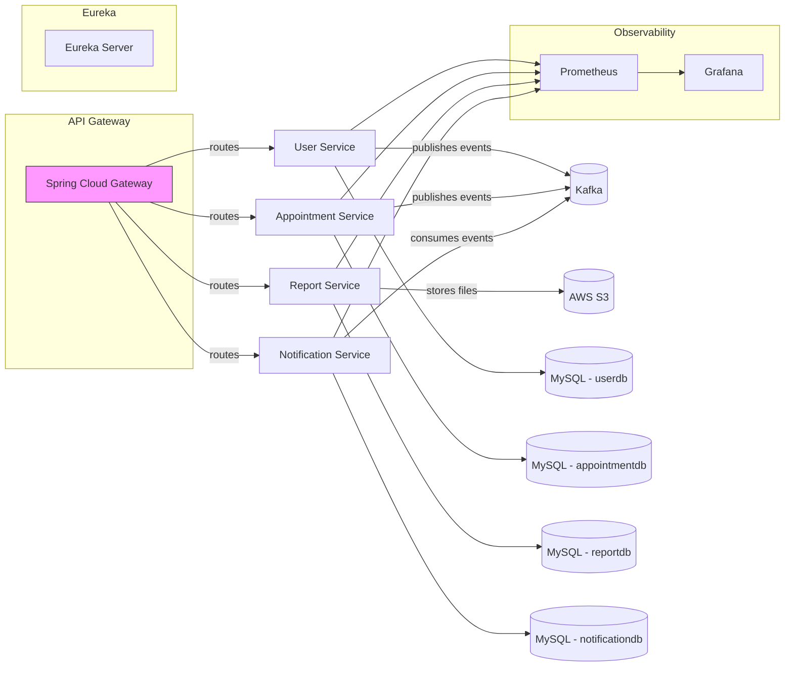

## System Design (High level)

Notes:
- Microservices communicate via REST and Kafka events.
- Gateway handles routing and JWT validation.
- Eureka provides service discovery.
- Config Server (not shown) holds central configuration.
