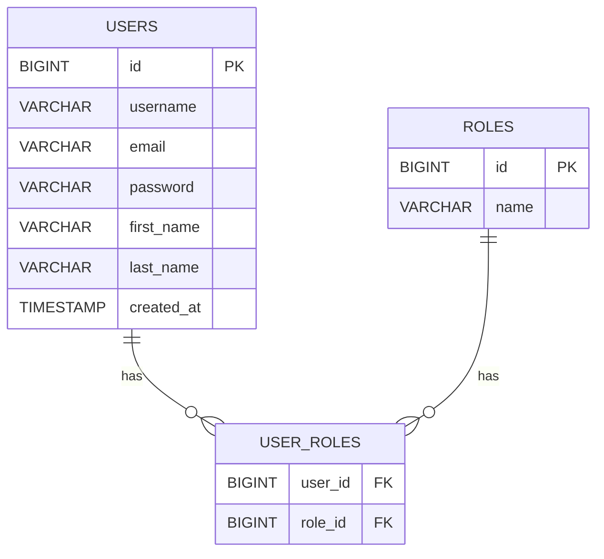

## User Service ER Diagram

```mermaid
erDiagram
    USERS {
        BIGINT id PK
        VARCHAR username
        VARCHAR email
        VARCHAR password
        VARCHAR first_name
        VARCHAR last_name
        TIMESTAMP created_at
    }

    ROLES {
        BIGINT id PK
        VARCHAR name
    }

    USER_ROLES {
        BIGINT user_id FK
        BIGINT role_id FK
    }

    USERS ||--o{ USER_ROLES : has
    ROLES ||--o{ USER_ROLES : has
```

Relations:
- `USERS` <-> `ROLES` many-to-many via `USER_ROLES`.
